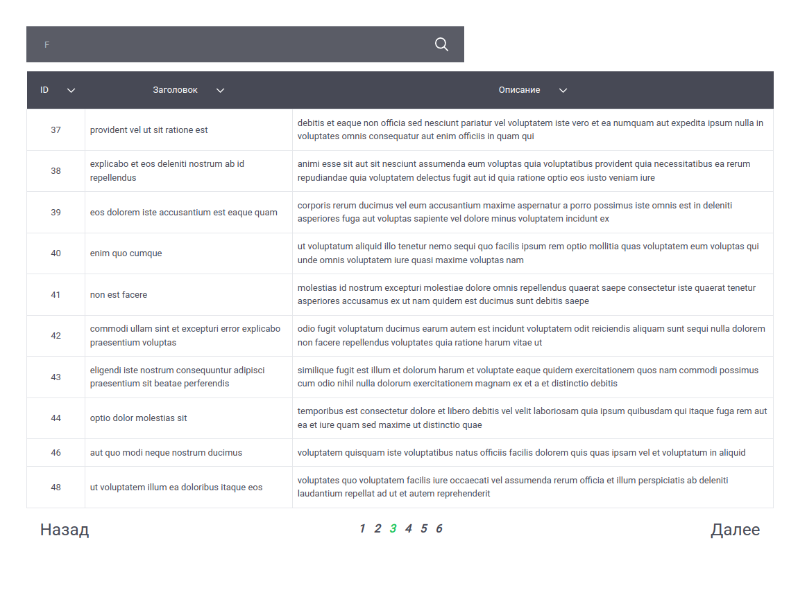

# Post table.

> Single page application in React to display a list of posts in a table. 


---

[Description](#description) •
[Project setup](#project-setup) •
[Features](#features) •
[How To Use](#how-to-use) •
[Project Status](#project-status) •
[Room for Improvement](#room-for-improvement) •
[License](#license) •
[Contact](#contact)



## Description

SPA in React, RTK, Redux-saga, TypeScript and TailwindCSS for display a list of post. 
User can search, sort, filter posts. There is pagination.

## Project setup

- Clone this repo to your desktop and run ```yarn``` or ```npm install``` to install all the dependencies.
- Once the dependencies are installed, you can run ```yarn dev``` or ```npm dev``` to start the application.
- Enjoy.

## Features

- State in Redux Toolkit.
- Search, Sort, Filter and Pagination posts in state.
- Fetch API.

## How To Use

Run [Live Demo](https://react-rtk-table.netlify.app/)

![tutorial][tutorial]

## Project Status

Project is: *in progress*

## Room for Improvement

To do:
- [ ] Add create, edit and delete posts. 

## License

This project is open source and available under the [MIT](../LICENSE).

## Contact
Created by [@RimidalU](https://www.linkedin.com/in/uladzimir-stankevich/) - feel free to contact me!

<p align="right"><a href="#start"></a></p>

<!-- MARKDOWN LINKS & IMAGES -->
<!-- [tutorial]: ./assets/screencast.webp -->
[tutorial]: ./assets/demo.webp
